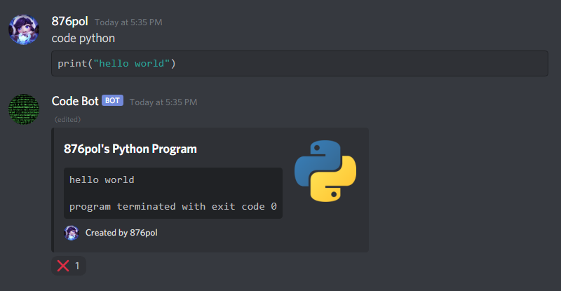

# Code-Bot
Code Bot is a Discord bot that runs code or acts as an online judge. Backend written with Java and Kotlin; frontend written with HTML5, CSS3, and JavaScript. Deployed to Heroku with Docker.
Link to a help page with all commands:
https://codebot123.herokuapp.com/help/index.html
___
To clone this repository:

	git clone https://github.com/876pol/Code-Bot.git
	cd Code-Bot

___
